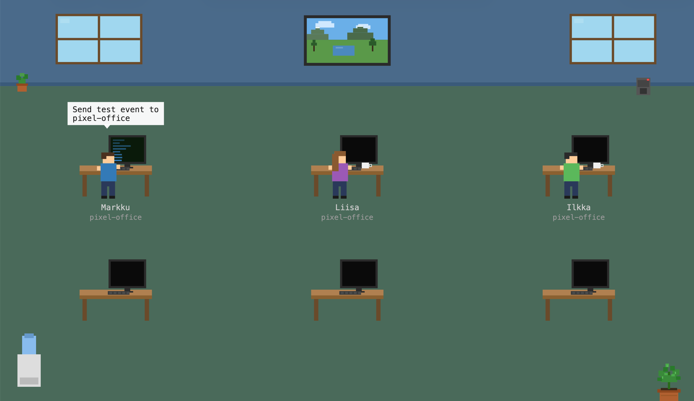

# Pixel Office

A gamified status view that visualizes Claude Code sessions as a **Game Dev Story**-style pixel art office. Each Claude activity (planning, coding, review, bugfix, etc.) is sent to the API, and pixel characters on the canvas react in real time.



## Tech stack

- **Backend**: Laravel 13 / PHP 8.4, SQLite
- **Frontend**: HTML + Canvas + vanilla JS (no build step)
- **Hooks**: Bash scripts for Claude Code hooks (`PostToolUse`, `Stop`)
- **Realtime**: Polling every 2s (WebSockets planned)

## Setup

```bash
composer install
cp .env.example .env    # SQLite by default
php artisan key:generate
php artisan migrate
php artisan serve        # http://localhost:8000
```

Frontend is served from `public/` (office.html, office.js, paintings/).

### Hooks

Set environment variables:

```bash
export PIXEL_OFFICE_URL=http://localhost:8000
export PIXEL_OFFICE_PROJECT=my-project
export PIXEL_OFFICE_NAMES="Alice,Bob,Carol,Dave,Eve,Frank"  # optional
```

Add to `~/.claude/settings.json`:

```json
{
  "hooks": {
    "PostToolUse": [
      {
        "matcher": "",
        "hooks": [
          {
            "type": "command",
            "command": "/absolute/path/to/pixel-office/hooks/post-tool-use.sh"
          }
        ]
      }
    ],
    "Stop": [
      {
        "matcher": "",
        "hooks": [
          {
            "type": "command",
            "command": "/absolute/path/to/pixel-office/hooks/stop.sh"
          }
        ]
      }
    ]
  }
}
```

Each Claude Code session automatically gets its own character (Markku, Liisa, Ilkka, etc.) based on the process ID. Up to 6 concurrent sessions are supported.

## API

### `POST /api/events`

```json
{
  "actor": "claude",
  "project": "my-project",
  "activity": "coding",
  "task": "refactoring auth module",
  "duration_s": 120,
  "ts": "2026-04-12T10:15:00+03:00"
}
```

Allowed `activity` values: `planning`, `coding`, `review`, `bugfix`, `testing`, `done`, `idle`, `waiting`.

### `GET /api/events/recent?since=<iso8601>`

Returns a list of events in chronological order.

## Tests

```bash
php vendor/bin/pest
```

## Customization

### Character names

Set `PIXEL_OFFICE_NAMES` to a comma-separated list of names (used by hooks to assign characters to sessions):

```bash
export PIXEL_OFFICE_NAMES="Alice,Bob,Carol,Dave,Eve,Frank"
```

In the frontend, define `window.PIXEL_OFFICE_CHARACTERS` before loading `office.js` to customize names, hair color, shirt color, and gender:

```html
<script>
window.PIXEL_OFFICE_CHARACTERS = [
    { name: 'Alice', hair: '#4a3020', shirt: '#337ab7', gender: 'female' },
    { name: 'Bob',   hair: '#2a2a2a', shirt: '#5cb85c', gender: 'male' },
];
</script>
<script src="office.js"></script>
```

## Roadmap

- Real pixel art sprites and animations
- WebSockets via Laravel Reverb
- Sound effects (8-bit)
- Daily activity summary view

## License

MIT
